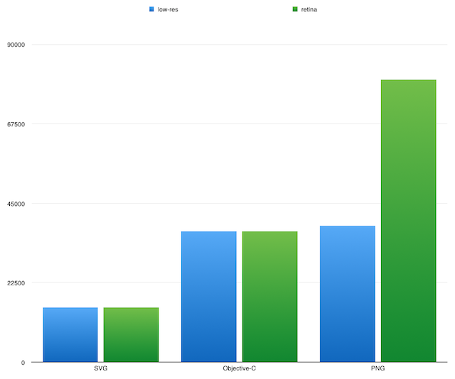

PMMetroView
===========

A UIView subclass to display the parisian subway lines' logo without any image files

# Why ?

Because I wanted to think about a way to use code to draw images for quite a while.
It should not be cumbersome to use. Thus converting an image to code or updating it
should be fast and painless. Thanks to CodePaint, this is almost possible.

Next step should be that CodePaint gives us size-independent code.

# Comparisons

Those are very simple tests for the moment being. Please feel free to add more

  - SVG : 15 489 bytes
  - h. + .m  : 37 061
  - PNG, 48pts x 48 pts , low-res/retina :  38591 / 80035 bytes

And because of what Da Vinci said:

Next steps should be to compare time from init to draw.

# Protocol

SVG were converted to `.h/.m` using CodePaint and to `.png` using:

    find . -name '*.svg' | xargs -n1 sh -c 'convert "$0" -thumbnail 96x96 "$0.png"'

Sizes were computed using

    find . -type f -name "metrol*.svg.png"  -exec ls -l {} \; | awk '{sum += $5} END {print sum}' 

# Credits

SVG files used comes from Clement Oriol's [MetroDNA](https://github.com/clementoriol/MetroDNA)